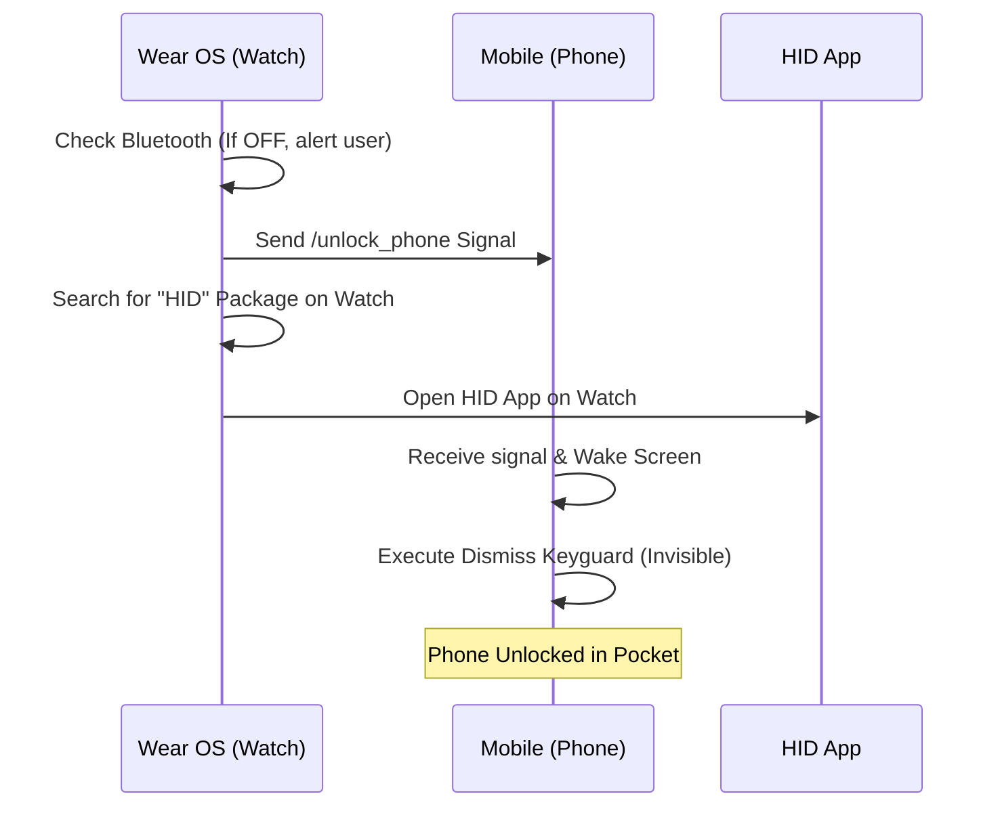

# 🚪 Door Project - Technical Documentation
> **Remote Unlock Solution and HID Mobile Access Integration**
> Version 1.0 | Status: Implemented

---

## 📋 Overview
The **Door** system is designed to eliminate friction in building access. It allows a user, through their watch (Wear OS), to perform two complex actions with a single tap:
1.  **Silent Unlock** of the smartphone in the pocket.
2.  **Automatic Launch** of the official HID Mobile Access application for NFC/Bluetooth authentication.

---

## ⚠️ Disclaimer
**This project is experimental and for educational purposes only.**
*   It utilizes only official Android and Wear OS APIs (e.g., `KeyguardManager`, `Wearable Data Layer`).
*   It **does not** bypass system security mechanisms; it relies on standard features like *Smart Lock (Trusted Devices)* to function.
*   It requires explicit user permissions and configuration.
*   This project is **not** affiliated with, authorized by, or in any way officially connected to HID Global. It does not automate or interfere with the internal security logic of the HID Mobile Access® application.

---

## 🔒 Privacy & Security
*   **Zero Data Collection:** This application does not collect, store, or transmit any personal data.
*   **No Cloud Dependency:** All communication happens locally between your paired watch and phone via encrypted Bluetooth/Google Play Services.
*   **Open Source:** The entire logic is transparent and can be audited by anyone.
*   **Official APIs Only:** No root access, no unofficial exploits, and no interference with third-party app data.

---

## 🛠️ System Architecture

### 1. Watch Module (`:app`) - "The Stealth Trigger"
The watch application acts as an invisible trigger. It has no user interface, focusing on execution speed.

*   **Technology:** Transparent Activity + Coroutines.
*   **Security:** Checks Bluetooth status before starting.
*   **Launch Intelligence:** Uses a dynamic search algorithm to locate any installed HID app variant, ensuring the system never fails due to version changes.

### 2. Mobile Module (`:mobile`) - "The Secure Bridge"
The smartphone acts as the executor of system permissions.

*   **Background Service:** The `WearMessageListenerService` uses Google Play Services infrastructure to wake the device instantly.
*   **Keyguard Bypass:** Through an ephemeral Activity, the system requests the Android system to discard the lock screen (via Smart Lock), allowing the phone to be ready for the door reader without manual intervention.

---

## 🚀 Operation Flow (End-to-End)

---

## 🛡️ Recommended Security Settings
To ensure the best "zero-touch" experience:
*   **Smart Lock:** The watch must be added as a *Trusted Device* in the Android phone settings.
*   **Battery Optimization:** Disable battery optimization for the Door app on the phone to ensure instant response.
*   **Permissions:** The app requires `QUERY_ALL_PACKAGES` on the watch to detect the HID app.

---

## 📝 Implementation Notes
*   **Dynamic Package Name:** The system searches for `contains("hid")`, making it compatible with `com.hidglobal.mobileaccess.app` and future versions.
*   **Silent Interface:** The use of `Theme.Translucent` ensures the user never sees "windows opening and closing", only the direct transition to the door app.

---
*Document generated automatically by the AI Development Assistant.*
